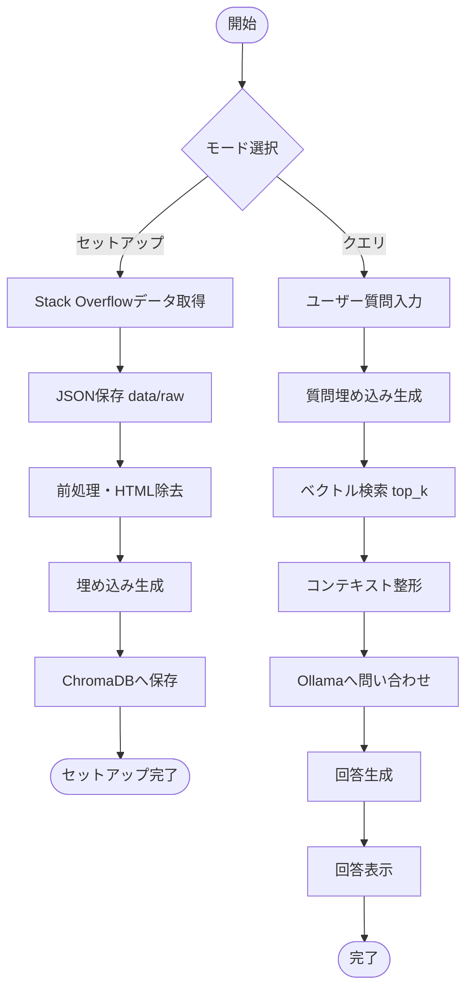

# アクティビティ図

```mermaid
flowchart TD
    start([開始]) --> mode{モード選択}

    mode -->|セットアップ| fetch[Stack Overflowデータ取得]
    fetch --> save[JSON保存 data/raw]
    save --> preprocess[前処理・HTML除去]
    preprocess --> embed[埋め込み生成]
    embed --> index[ChromaDBへ保存]
    index --> done_setup([セットアップ完了])

    mode -->|クエリ| input[ユーザー質問入力]
    input --> q_embed[質問埋め込み生成]
    q_embed --> retrieve[ベクトル検索 top_k]
    retrieve --> context[コンテキスト整形]
    context --> llm[Ollamaへ問い合わせ]
    llm --> answer[回答生成]
    answer --> output[回答表示]
    output --> done_query([完了])
```
