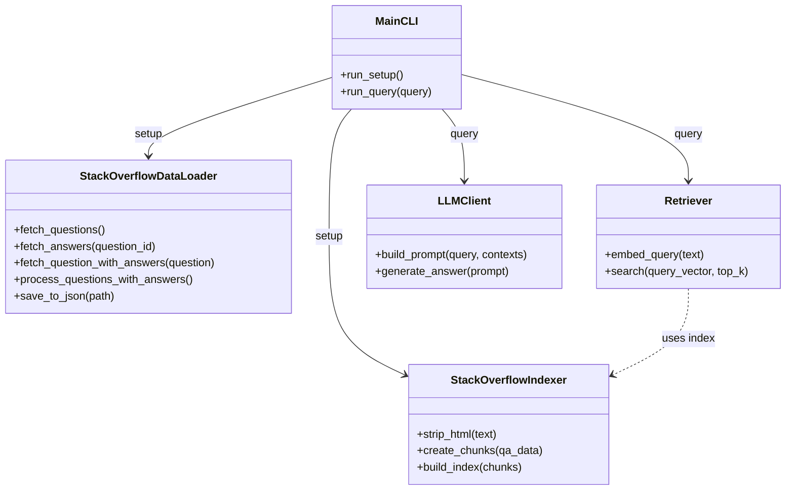

# クラス図

```mermaid
classDiagram
    class StackOverflowDataLoader {
        +fetch_questions()
        +fetch_answers(question_id)
        +fetch_question_with_answers(question)
        +process_questions_with_answers()
        +save_to_json(path)
    }

    class StackOverflowIndexer {
        +strip_html(text)
        +create_chunks(qa_data)
        +build_index(chunks)
    }

    class Retriever {
        +embed_query(text)
        +search(query_vector, top_k)
    }

    class LLMClient {
        +build_prompt(query, contexts)
        +generate_answer(prompt)
    }

    class MainCLI {
        +run_setup()
        +run_query(query)
    }

    MainCLI --> StackOverflowDataLoader : setup
    MainCLI --> StackOverflowIndexer : setup
    MainCLI --> Retriever : query
    MainCLI --> LLMClient : query
    Retriever ..> StackOverflowIndexer : uses index
```
