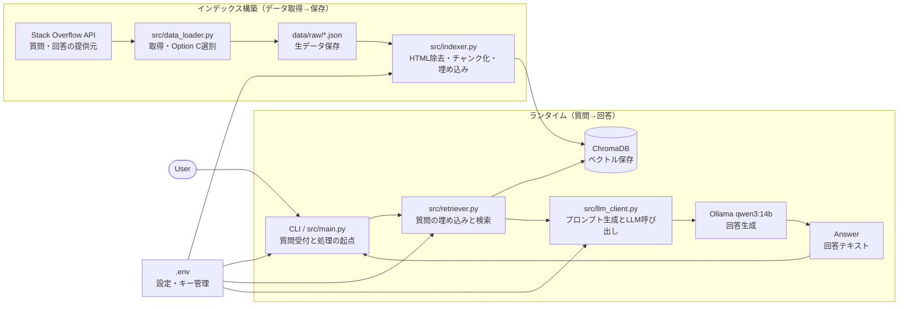

```mermaid
flowchart LR
    user([User]) --> cli[CLI / src/main.py<br/>質問受付と処理の起点]

    subgraph Runtime["ランタイム（質問→回答）"]
        cli --> retriever[src/retriever.py<br/>質問の埋め込みと検索]
        retriever --> chroma[(ChromaDB<br/>ベクトル保存)]
        retriever --> prompt[src/llm_client.py<br/>プロンプト生成とLLM呼び出し]
        prompt --> ollama[Ollama qwen3:14b<br/>回答生成]
        ollama --> answer[Answer<br/>回答テキスト]
        answer --> cli
    end

    subgraph Ingestion["インデックス構築（データ取得→保存）"]
        so_api[Stack Overflow API<br/>質問・回答の提供元] --> loader[src/data_loader.py<br/>取得・Option C選別]
        loader --> raw[data/raw/*.json<br/>生データ保存]
        raw --> indexer[src/indexer.py<br/>HTML除去・チャンク化・埋め込み]
        indexer --> chroma
    end

    env[.env<br/>設定・キー管理] --> cli
    env --> retriever
    env --> prompt
    env --> indexer
```
